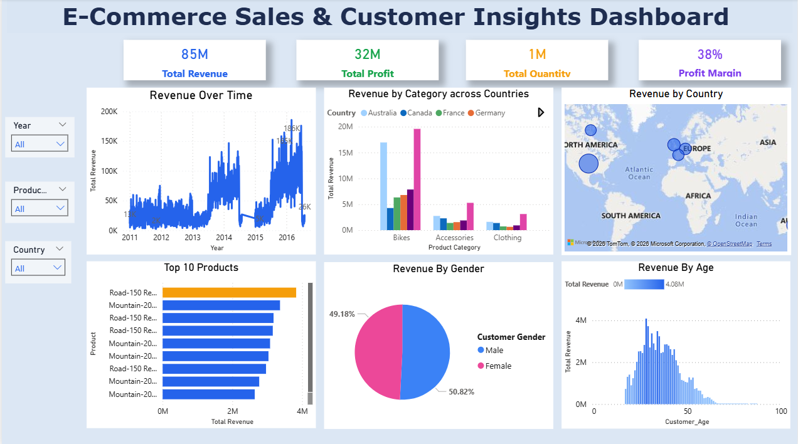

# 🛒 Ecommerce Sales & Customer Insights Dashboard

## 📊 Overview

This project focuses on analyzing ecommerce sales data using **Power BI** to uncover meaningful business insights.
The dashboard provides a clear view of **sales performance, customer behavior, and product trends** through interactive visualizations.

---

## 🎯 Objectives

- Evaluate overall revenue and profitability
- Identify top-performing products and categories
- Analyze customer demographics and purchasing patterns
- Understand regional sales distribution
- Enable interactive filtering for dynamic analysis

---

## 🛠️ Tools Used

- Power BI
- Power Query (Data Cleaning)
- DAX (Measures & Calculations)
- CSV Dataset

---

## 🧹 Data Preparation

- Cleaned raw data and handled missing values
- Corrected data types for accurate analysis
- Standardized categorical values (e.g., Gender)
- Created calculated metrics like **Profit Margin**

---

## 📈 Dashboard Features

### 🔹 Key Metrics

- Total Revenue
- Total Profit
- Total Quantity Sold
- Profit Margin

---

### 🔹 Sales Analysis

- Revenue trend over time
- Category-wise revenue across country comparison
- Region-wise (country) sales distribution

---

### 🔹 Product Analysis

- Top 10 products by revenue

---

### 🔹 Customer Analysis

- Revenue by gender
- Revenue by age group

---

### 🔹 Interactivity

- Filters (Slicers):
  - Year
  - Product Category
  - Country

- Dynamic updates across all visuals

---

## 📊 Dashboard Preview

---

## 🔍 Key Insights

- A small group of products contributes to a large portion of total revenue
- Some categories generate high sales but lower profit margins
- Sales performance varies significantly across regions
- Adult customers contribute the highest share of revenue

---

## 📁 Project Structure

Ecommerce-Dashboard/
├── data/
├── dashboard/
├── screenshots/
└── README.md

---

## 🚀 How to Use

1. Open the `.pbix` file in Power BI Desktop
2. Use slicers to filter data
3. Explore insights through interactive visuals

---

## 👤 Author

Tanvi Kulkarni
Aspiring Data Analyst
